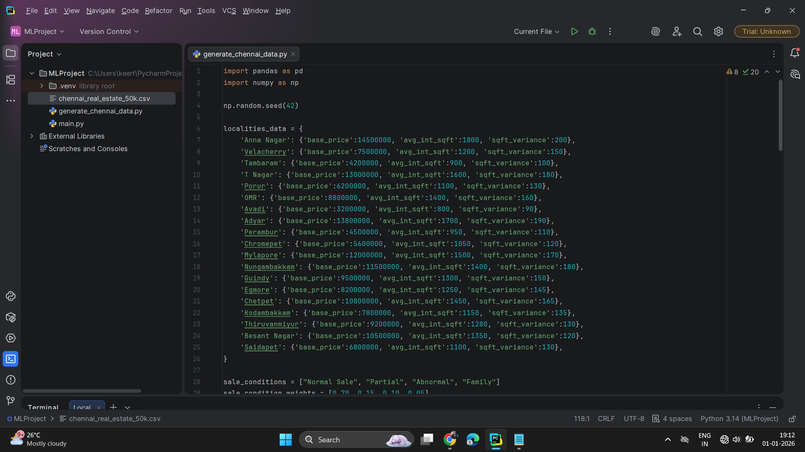
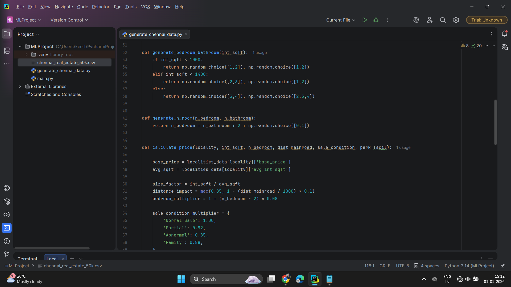
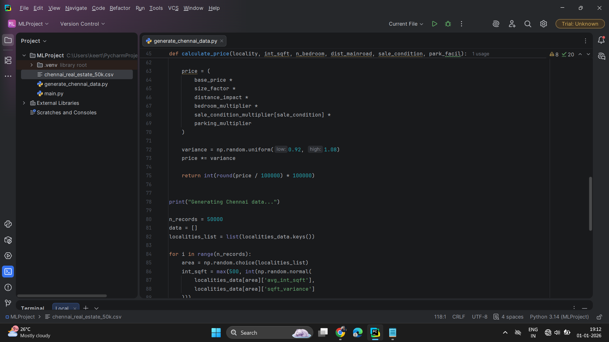
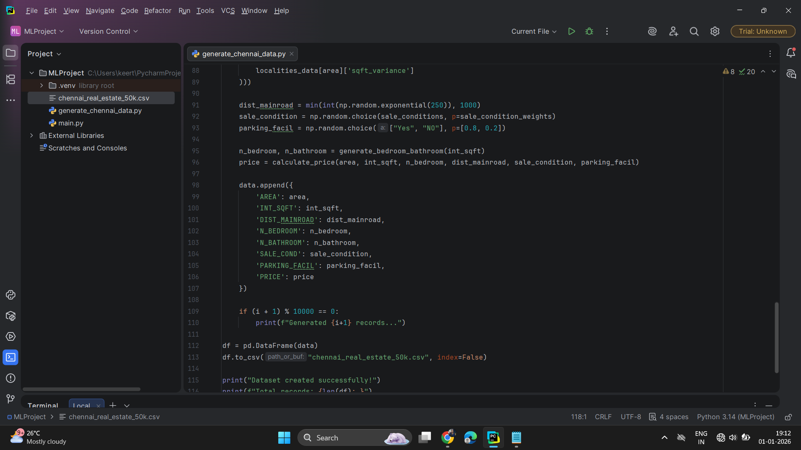
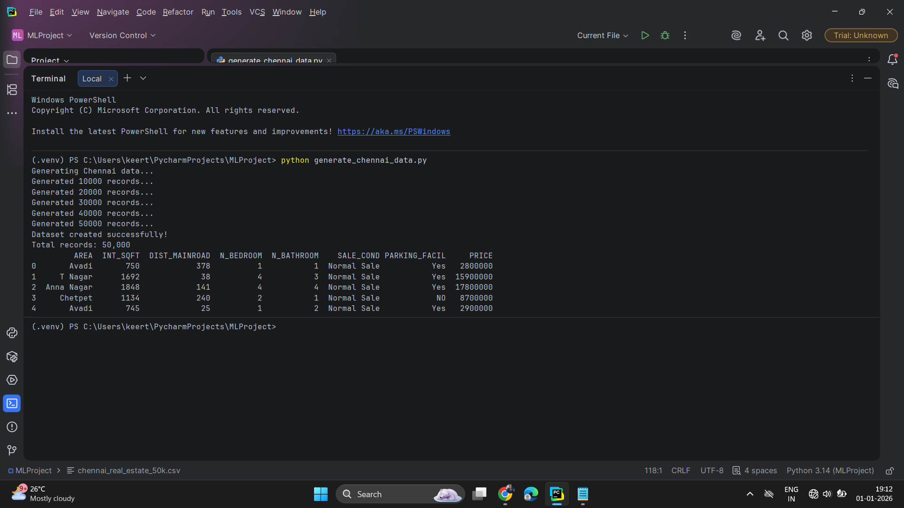
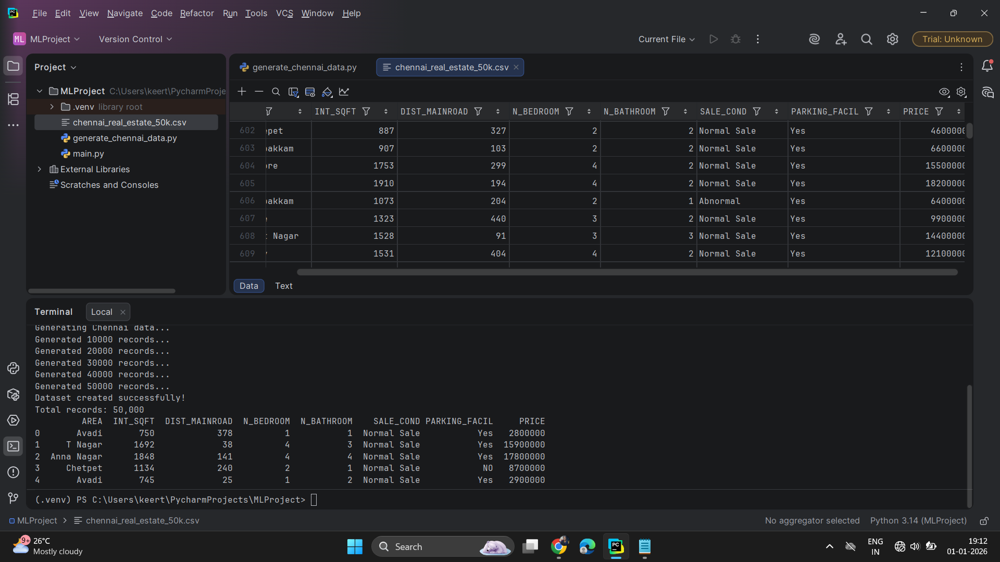

# Chennai Real Estate Data Generator 🏠

This project is a **Python program** that generates a **synthetic dataset of 50,000 Chennai real estate listings**.  
It helps practice **data analysis 📊, machine learning 🤖, and dataset handling 🗂️** without needing real-world data.

## Project Overview

Generates **property listings** with realistic attributes like:

1. Location
2. Price
3. Size
4. Type of property

Useful for **data analysis, testing ML models, and educational purposes**.

## Output

Note ⚠️: The full dataset is large (50,000 entries) and cannot be displayed in the browser.  
         You can download the dataset from the repository to run your own analysis.

         
## How to Use

- Clone the repository to your local machine.

- Open the project in PyCharm or any Python IDE.

- Run the Python script to generate the dataset.

- The output will be displayed in the console, and you can save it as a CSV file.

## Tools Used 🛠️
- **Python** 🐍
- **Libraries**: numpy 🔢, pandas 🐼
- **IDE**: PyCharm 💻

## Author
   Keerthana
